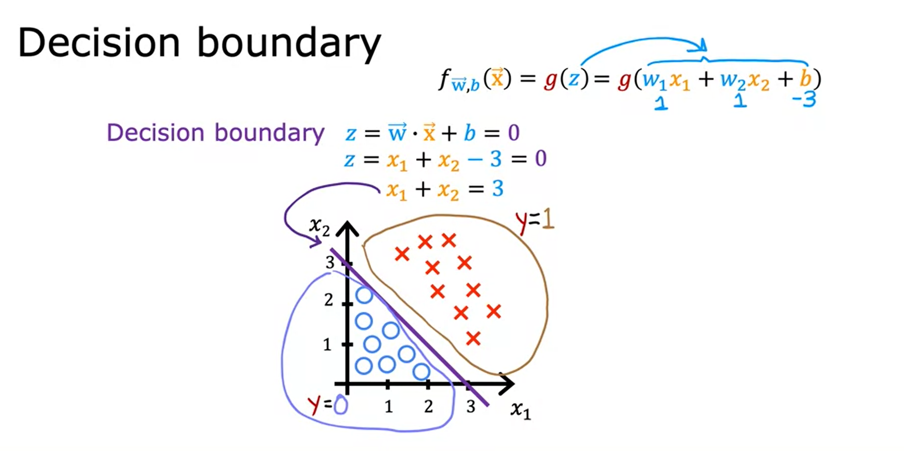

# ⤴ Logistic Regression

- The "regression" term comes from the historical purposes

- The "linear fit" may or may not work in the classification case (unless you get lucky)

- **There can be outliers** and they influence the decision boundary *a lot* and hence not usable in the classification case.

👉🏻 **Sigmoid / Logistic Function Properties**: $\frac{1}{1 + e^{-z}}$

- Uses exponent in the denominator, so if the `z` is very large, the $e^{-z}$ becomes very tiny leading to the 1/1 case where the total value becomes closer to 1.

- When the `z` is so negative number, the whole exponent term becomes large, leading the whole value close to 0. *(recall, the number is negated - so negative becomes positive and vise-versa)*.

- When `z=0` then the exponent is `1`. Thus, the sigmoid is `0.5`

## 🚶🏻‍♂️ Steps for Logistic Regression

1. **Learn** the linear regression, $z = \vec x \cdot \vec w + b$

2. **Pass** this `z` in the logistic function: $g(z) = \frac{1}{1 + e^{-z}}$

3. **Final** thing: $f(\vec x, b) = g(\vec w \cdot \vec x + b) = \frac{1}{1 + e^{-(\vec w \cdot \vec x + b)}}$

> ### 🤯
> 
> In the paper, when you read the following...
> 
> ### $f_{\vec w,b}(\vec x) = P(y = 1 | \vec x; \vec w,b)$
> 
> ...it simply means the ***probability of `y`  being `1` given these values and weights.*** And the semicolon `;` is just to separate that the left is input and the right are the weights.

## 🌳 Decision Boundary!

> *The setting where our all features `x1, x2,... xn` are set in such a way that **the whole equation** `z` is equal to `0`* — this; is the decision boundary — or the line which separates both classes.
> 
> 
> ## 🔴
> 
> **NOTE**: The decision boundary **is not the** threshold! Threshold is **what we set**, and this boundary is **learnt** by the model — this is what is drawn in the ***complex chart*** of the logistic regression.

**Example:**

**Interpretation:**

- Given the equation, we know that the decision is taken when the value is above or below `0.5`. And `0.5` is **only achieved** when the `z` is `0`.

- So, to make the `z` the `0`, we will need to set the x1 and x2 in such a way that they cancel out the `b`; which is `-3`.

- That's it.

> ***The decision boundary can also be circle, non-linear etc*** when we have the polynomial features in the logistic regression 😏

# 💵 Cost Function *ft. Logistic Regression*

> ***The cost function for the logistic regression <u>is non-convex</u>***; which means there can be <u>many local minimas</u> — ***IF*** used the loss function for the linear regression; sum of squared error like below 👇🏻

🤔 *But, we can make the loss function **convex again for  logistic regression** if we make some changes...*

### 🙌🏻 Actual Cost function for Log-Regression

> *This is the reason why it is called "**log**"istic regression!*

**The cost function is as follows:**

**Interpretation:**

- When the **actual `y=1`** we do the `-log(sigmoid_output)` which is between `0` and `1`.

- When the **actual `y=0`**, we do the `-log(1 - sigmoid_output)`.

- So, if the log is near `1`, the cost will be near `0` and vice-versa.

- Using `-` negation sign, to make the loss positive (otherwise the log returns negative loss)

### The simplified loss, rewritten 😉

> ## $L(f_{\vec w, b}(\vec x)) = -y \times log(f_{\vec w, b}(\vec x)) -(1-y) \times log(1 - f_{\vec w, b}(\vec x))$

**OR** much simpler...

> ## $L(\hat y) = -y \times log(\hat y) -(1-y) \times log(1 - \hat y)$

👉🏻 **This only works, because we have binary variables 0, 1.**

😲 See!? Exactly same **as we did in the linear regression**! Just the internals have changed.

# 💍 Addressing Overfitting

1. Get more data, if you have more data, then higher chances that the model **won't be too much wiggly** and will have a generalized pattern.

2. If more data *isn't possible*, then **use fewer features.**

3. **User regularization!** 🔥

## 🔧 Regularization: A new perspective

The **method 2** we saw ***to eliminate*** the feature as a whole — which is kind of harsh; but Regularization provides a way to "lower the impact" of some irrelavant features **while keeping them** in the model.

- So, if by regularization you are able to make `w2` (some weight) to `0`, then that feature is eliminated — we can say that.

- But if by regularization, the `w2` is small like `0.01` then still it has impact but is small.

- In practice, you can **also regularize the `b`**. But that doesn't make any impact. So, don't touch that!

### We add the stuff in the cost function.

> ## $\frac{1}{2m}\sum_{i=1}^{m} (f_{\vec w,b}(\vec x) - y)^2 + \frac{\lambda}{2m} \sum_{j=1}^{n} w_j^2$

So, higher weights are **squared** and hence will make the cost function higher...

> 👉🏻 $\lambda$ can be `0` to $\infin$.

# 🎉 Let's continue with the next course!

