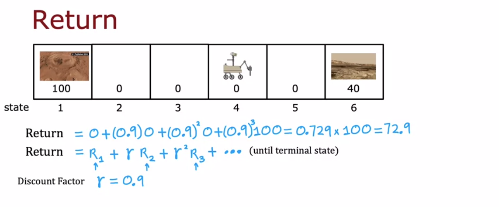
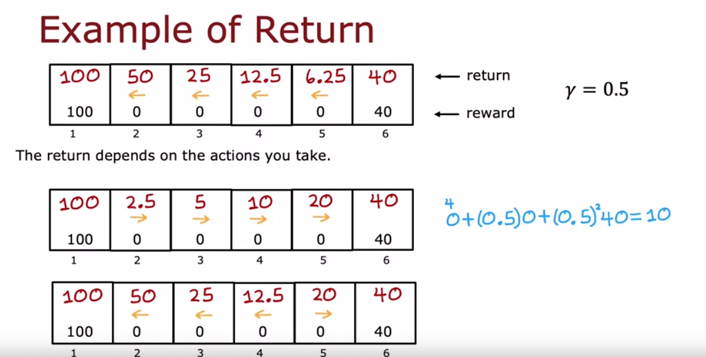
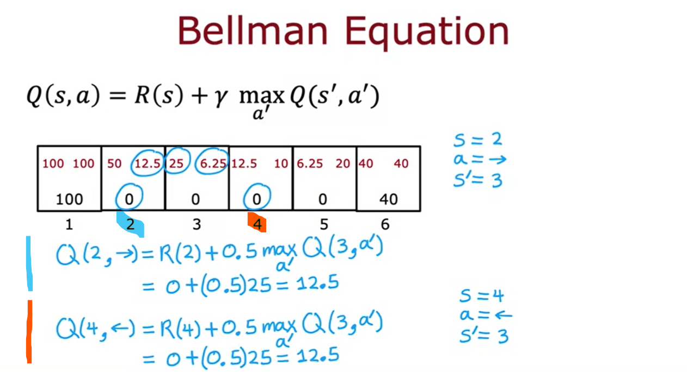

# 🤖 Reinforcement Learning

We could use the supervised learning for the task that reinforcement can solve, but that would require limitless number of **combinations** to train with.

It makes use of:

1. State

2. Action

3. Reward

And of course an agent.

### Applications

1. Controlling Robots

2. Factory stock optimization (how would you arrange the stock so that they will optimize the throughput and efficiency)

3. Financial Stock Trading (⭐)

4. Playing Games

## 🔼 The `return`

- Let's say I have put **two** carrots put on the place `H` and single carrot placed on `B`.

- You are on `A`.

- Which one is better. Of course `H`. But for that you need to spend a lot of time.

- Often the shortest way is better. So just pick `B` and stay happy.

- So, here we can say like: "*even though we get the same reward by taking both ways, one of them is better then another because of some reasons.*"

- And <u>that</u> can be explained by the "**return**".

> 👉🏻 It is: What return do you get from taking certain actions.

# 💵 Sooner rewards matter.

#### **Don't freak out!**

**Back story**

- Here, one robot is placed on the mars. It is on the state `4` for now.

- All states, 2, 3, 4 and 5 give the reward `0`.

- We are **only interested in** states 1 and 6 because they are some best places for the rover to stand upon to get the better pictures of the mars - which have the reward `100` and `40` respectively.

**Present**

- Now the robot takes random moves and gets rewards.

- Some times goes to 3, 2, and then 1 from 4th state getting 0 + 0 + 100 = 100 reward

- Some times it does some stupid (remember random moves) 3, 2, 3, 4, 5, 4, 3, 2, 1... so after all of these moves it gets 100 reward!

**Getting the `return`**

> Return is just the `sum` but it is weighted.

The weight **decreases** as the step increases. Here in the screenshot attached above shows that example where we have "**discount factor $\gamma$**". That is a value which is ***set to close to 1 but not 1.***

- In the example that is set to `0.9` and that decreases as the step increases.

- So if the rover gets reward on 2nd step then it would value more than getting the same reward on the 10th step 😊😊😊

- The $\gamma$ has a power and it increases by 1 unit: $\gamma^0, \gamma^1, \gamma^2 ...$

> **Terminal state:**
> 
> It is a state where the rover or the agent stops (like end of the day). So there we will start calculating the total reward.
> 
> *Terminating states are important in the reinforcement learning framework because they define the boundaries of an episode.*
> 
> In the case of helicopter... the termination steps could be 👇🏻
> 
> 1. **Crash or Collision:** If the helicopter crashes or collides with an obstacle, that could be a termination state. The episode ends, as further actions in such a situation might not be meaningful.
> 
> 2. **Reaching a Goal:** If the goal of the task is to reach a certain location or altitude, reaching that goal could trigger a termination state. The episode ends when the helicopter successfully accomplishes its objective.
> 
> 3. **Timeout or Maximum Time Steps:** If there's a predefined maximum duration for each episode, the episode might terminate when that time limit is reached. This helps prevent the agent from spending too much time on a single episode.
> 
> 4. **Out-of-Bounds:** If the helicopter goes out of a specified airspace or geographical region, it could be considered a termination state. This ensures that the helicopter stays within the defined operational boundaries.

# 🗺 Not single action treats all

Read from left - above and then move down slowly.

1. Let's say we always choose to go left. Then the rewards are written there in the first grid blocks.

2. Let's say we always choose to go right, then the rewards are written in the second block below.

So, we can see for the starting blocks 2, 3 and 4 it is **advisable** to always go left. But **if you are on the stat 5** then you should go right.

And that's what the last state grid tells us.

# 📃 Policy

It is a simple function that **directs the agent to take next action based on the state the agent is in**.

> The agent can move randomly, but we can also give some policy that it should follow. Like "go to the left unless you are one step closer to the lower reward, then right".
> 
> As you can see, it is an **area** in which we can get as creative as possible while staying logical!

# 🔥 The Markov Decision Process!

What we have been talking this far has a name. It is called MDP.

- It states, **the future only depends on the current state** and not **which might have already occurred till now.**

> *The future depends on where you are now, and not how you got here.*
> 
> — Markov and Andrew

# 🦆 The `Q` function

This is the "center" of the reinforcement learning. Before heading towards the details, let's see its names.

**The `Q` function is also called by the following names:**

- State - Action function

- Q*

- Optimal Q Function

### ❔ What is it?

This function is used **to explore all possible actions from the state `s` and calculate the reward for respective action.**

🔄 Which means it goes by the following:

1. Start with the state `s`.

2. Take an action `a`.

3. **Then behave optimally (till the terminal state)**

The 3rd one may look paradoxical, and it feel circular... but that will be resolved later. Let's look at *an example* for a head start.

### Example:

Let's say we have one policy like given below *(once again, in the start we don't have that... but say for the sake of this example)*

- The policy shows the action to take on the respective state to get the maximum reward.

- Again, the policy will be set once we run the algorithm, but again for the sake of example let's say we have the policy already.

- The Q function has not yet come into the picture.

#### Now take an action.

The action can be anything, left or right *(in this case, because we can take only two actions in this world)*.

Let's say:

- We are on the state number `2`

- We take the action to go right (→)

So,

$Q(s, a)$ = $Q(2, →)$

1. Start with the state `s`: Here `2`.

2. Take action `a`: Here it will be to go right and it becomes `3`.

3. Then behave optimally (till the terminal state): From `3` we need to follow the policy which states that we should go to left... and then we will finally reach to the terminal state `1`.

👉🏻 Here the rewards will be: $0 + .5*0 + .5^2*0 + .5^3*100 = 12.5$

Thus, the **Q function $Q(2, →)$** will return `12.5`.

____

Let's *(now)* say:

- We are on the state number `2`

- But, we take the action to go left (←)

So,

$Q(s, a)$ = $Q(2, ←)$

1. Start with the state `s`: Here `2`.

2. Take action `a`: Here it will be to go right and it becomes `1` *(the terminal state)*.

3. Then behave optimally (till the terminal state): We already are on the terminal state.

👉🏻 Here the rewards will be: $0 + .5*100 = 50$

Thus, the **Q function $Q(2, ←)$** will return `50`.

____

**Which means**, in this environment we will have total 2 returns for any state `s`.

- We can either go to left or right and then we follow the policy.

- By this way we will have 2 results of the function Q for each states.

### 🏟 Doing that for all states

- The first (left) number denotes the action left (←) and second number for action right (→) on the respective state.

> ## 💡
> 
> ***Which means the best possible return for the stat `s` is the $max Q(s,a)$.***

# 🐎 Bellman Equation

According to the steps:

1. Start with step `s`

2. Take any action `a`

3. Then behave **optimally**.

The behaving optimally will require some logic; but at the start it will be nothing. Here we will see how to start creating the way.

> Quick note: The bellman equation is just the formal way to state what we have done above. It just is the mathematical formulae to what to do from the state `s` and so on. Nevertheless, let's have a look.

### The equation

### $Q(s, a) = R(s) + \lambda \times max Q(s', a')$

- $s$ : The current state

- $a$ : The action that we take (left or right)

- $R(s)$ : The immediate reward that we get from this state *(current stage reward)*.

- $\lambda$ : The discounting factor.

- $s',  a'$ : The next state that we reach upon from current state and by taking action `a`. And the same next action that we take from next state respectively.

That's it! Let's see with an example.

Here we have tested the equation for **two settings**:

- The blue one is **when we start** from the state `2`. 

- There just follow along and you will get the jist.

**Key takeaway from that lecture:**

- Bellman equation defines the formal way to do stuff.

- When we say "take max" it means keep following the path which gives the highest reward (and that means to behave optimally)

> The main point is ***bellman equation doesn't create anything.*** It just states how to react and just **compressed the 3 steps** that we discussed above. "To behave optimally" simply means, follow the policy.
> 
> Note: That thing may change in the future, as I learn. But for now it is what it is.

# 🪜 The uncertainty of the movement
It is entirely possible that, when you move the *helicopter* to the left, it goes to right and down! And that is called **uncertainty**.

> So, that can be formalized by <u>**"random misstep"**</u>.

Certainly! In this lecture on reinforcement learning, the key points are as follows:

- **Reinforcement Learning Problem**:
  - The reinforcement learning problem is **stochastic**, meaning that there isn't a single fixed sequence of rewards. Instead, you encounter a variety of different rewards over time.
  - Unlike deterministic scenarios, where we can predict outcomes precisely, in stochastic reinforcement learning, we deal with uncertainty.

- **Objective in Stochastic Reinforcement Learning**:
  - Our goal is **not** to maximize a specific return value (since it's random).
  - Instead, we aim to maximize the **average value** of the sum of **discounted rewards**.
  - By "average value," we mean that if you were to try out your policy multiple times (e.g., a thousand or a million times), you'd get various reward sequences.
  - Taking the average over all these different sequences gives us the concept of **expected return**.

> ***So, the job of the reinforcement learning algorithm is to come up with the way to maximize the overall average return.***

# 💣 The state is made up of vector!
Yeah, and of course, *obviously!*

Till now we have seen that the state could be some discrete single number, but in the **real scenario** it would be a vector of numbers.

Like, just take an example of a helicopter. **There the state won't be a single number**. But, it would be like `s = [x, y, rotation, x_velocity, y_velocity, rotation_velocity]` etc.

So, yeah just keep that in mind!

# I think we are done, done!?
Next lectures are going little bit in detail, but not much that I can wrap my head around completely. Since this is **not a specialization** on the RL, I think it will be better to just watch them and leave the practical RL to its future specialization.

So...
Ending notes!?

> Bye, then! It has been an amazing journey. I completed first 75% of the course in like 1 week and the rest took 2 months because of loooong gaps. But finally the course seems to be done. I have learnt many new things and also got confident in the existing areas. 
>
> All thanks to the legend Andre NG 🙏 

Let's meet in another course!