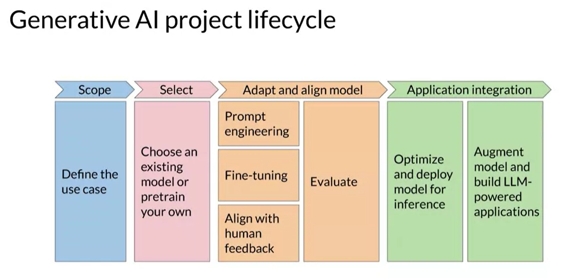
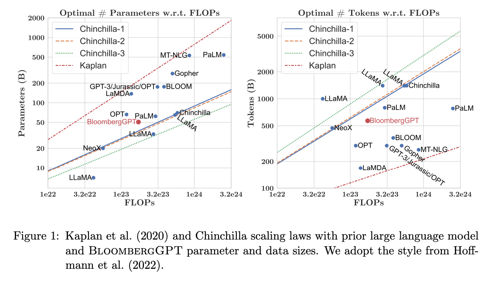

# `1.` Intro

- To discuss the whole life cycle of building an application with the LLMs

- How to decide which LLM to choose, whether the multi billion param model or just a small model tuned for a single task.

- Quantization and the precision

- Multi GPU training

- Chincilla paper and rules of ~~thumb~~ research

# `2.` Text generation before transformers

Previously text generation done with **"Recurrent Neural Nets (RNNs)"**.

- They were powerful at that time, but limited by the context they could see.

- Were poor in understanding the context of the language *(e.g. ambiguous words)*

# `3.` Some details about transformers

Woof, I already have done a whole course on the transformers, check that out [here]([GitHub - AayushSameerShah/Neural-Net-Zero-to-Hero-with-Andrej: This repository contains the collection of explorative notebooks pure in python and in the language that we, humans can read. Have tried to compile all lectures from the Andrej Karpathy's ?虫 playlist on Neural Networks - which we will end up with building GPT.](https://github.com/AayushSameerShah/Neural-Net-Zero-to-Hero-with-Andrej)).

- Self attention head **can learn the relationships** between all words.

- We can have **multiple self-attention layers**.

- Each layer can learn different aspects of the language. And there can be `12-100` layers in the multi-head attention block.

- One layer can understand the words *related to people*, and other may learn about the *activities*. But we can't know what aspect will be learnt by each layer beforehand and also the interpretation of layer isn't intuitive.

### Can be used alone:

1. **Encoder Only Models:** Classification tasks such as "sentiment analysis". Eg. B**E**RT.
   
   - Also called "Autoencoding models".
   
   - Trained using "masked language modeling"
   
   - Some part of the sentence is `<MASKED>` and the task of the model is to restructure the sentence. *(Also called "Denoising" objective)*.
   
   - Hold the **bidirectional representation**. Thus, the information can flow through both direction.
   
   - ***Usecases***: Sentiment Analysis, NER, Word Classification.

2. **Encoder-Decoder Models:** Seq-to-Seq task such as "translation". Eg. T5, B**A**RT.
   
   - The exact training details vary model to model.
   
   - Popular T5 uses **"span corruption"** as the training objective.
   
   - It `<MASKS>` `<WORDS>` in the given statement and the model needs to autoregressively structure the given span.
   
   - ***Usecases***: Summarization, Classification and QA.

3. **Decoder Only Models:** Can generalized to all tasks. Eg. GPT-2, LLama, Bloom.
   
   - Also called "Autoregressive models".
   
   - Trained using "Causal language modeling".
   
   - Task is to predict the next word.
   
   - Context is **unidirectional**. The context flow is only in the one side. Upto that token.
   
   - ***Usecases***: Text generation, other tasks as well (depending on the model size).

> 💡
> 
> In the generation we "sample" the next token which is **random** but is **weighted random** because there we also see the probability and don't blindly pick up the next token.

# `4.` LLM Project Lifecycle

## Scope:

- **Clear and as narrow** as possible

- Does the project require the same model to work on **different tasks**? Or just a single task?

## Select:

- Mostly we will **start with the pre-trained** model.

- In specific cases one would need to pre-train the model; but too much costly.

## Align the model:

- **Assess the performance** (prompt eng.) of the model and carry out additional training if needed (fine tuning).

- **Align with human feedback** (RLHF).

- Evaluation.

- This phase is **highly iterative**.

## Application integration:

- Best use of computer resources.

# 🤏🏻 Quantization

- **FP32** is called **"full precision**"; and it uses:
  
  - `1` bit for sign
  
  - `8` bit for exponent (**123**.000)
  
  - `23` bits for mantissa/fraction/significand (123.**000**)

- **FP16** is **"half precision"**; and it uses:
  
  - `1` bit for sign
  
  - `5` bits to exponents
  
  - `10` bits for fraction

- **BF16** is half but can cover the range same as FP32 in the exponent part:
  
  - `1` bit for sign
  
  - `8` bit for exponent
  
  - `7` bit for fraction

- **8INT** is the integer representation:
  
  - `1` bit for sign
  
  - `7` fraction bits

> 📝
> 
> Currently the techniques like **Quantization Aware Training (QAT)** are developed, where the quantization happens during the training so that the weights are adjusted according to the quantized weights which improves the performance *in contrast* to the post-quantization.

# 🪂 Multi GPU Training

## `1.` Distributed Data Parallel (DDP)

- This is applied **when the model can fit in the single GPU**.

- Let's say we have 8 GPUs, then the same model is loaded in each GPUs but the **data is distributed**.

- All GPUs will get different set of data and after the forward pass of a given batch, the back prop is done in all GPUs and the weights update is done **in sync**.

- Thus, at each time `t`, all GPUs will have the same updated weights.

## `2.` Fully Sharded Data Parallel (FSDP)

- When the model sooo big that it **can't fit in the single GPU,** then we will use this technique.

- Motivated by the method "ZeRO" - Zero Redundency Optimizer.

**Some other information**:
Basically while training there are 3 components to store in the GPU:

1. Adam optimizer states
2. Weights
3. Gradients

While using FSDP you have `3 options` to shard the model:

1. Only distribute the Adam optimizer states

2. Distribute Adam + Weights

3. Distribute all.

# 🧪 Rule of ~~thumb~~ Research

Research has explored the relation between:

☝🏻 **Model Size**

✌🏻 **Training configuration**

🤟🏻 **Performance**

> **Chincilla paper** really has a ***good set of guidelines*** which help decide the data size, model size and all.

More on this later :)

# 👨🏻 When to pretrain?

- When the down stream task involves completely **new set of tokens**.

- Uses **different language** (Gujarati, SQL, Coding).

- Uses industry specific **jargons** (legal, medical, finance etc.).

**Takeaways:**

- *(left)* The BloombergGPT closely follows the rules as based on the parameter size of the model, they have trained the model *enough (FLOPs).*

- *(right)* They have used the data ***just below*** the recommended by the chincilla paper. *(because maybe there are not too much data related to the financial domain - Bloomberg for financial domain pretraining)*.
