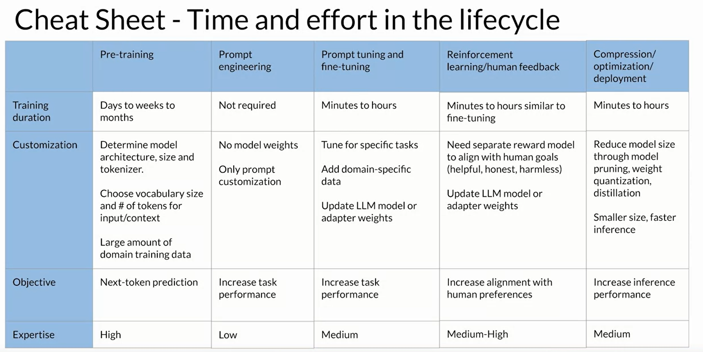

# `0.` Intro

- RLHF 🔥

- Reward Hacking

- Constitutional AI

- Agents and actions

# `1.` Models performing badly... how?

The **"HHH"**

- **HELPFULNESS?**: Hey yo!! → Said a person... *(not helpful)*

- **HONESTY?**: My eyes are soaring → play more screen games!! *(hah!)*

- **HARMLESS?**: How to unlock a steel lock without a key? → Step-1 *(👀)*

# # 👔 Reinforcement learning from human feedback (RLHF)

We are here after all the work done in the benchmark test and all... so the model is mature enough right now. The process that the model has been through is as follows: `Pretraining → Fine-tuning → RLHF`

1. The model should not be dumb, it should have some capability to carry out the task that you want to.

2. Typically we will start with the **instruction tuned model** as it has ability to follow the instructions.

## 🎗 Reward Model

### 🔄 The Process

1. Start with the dataset which.

2. The model outputs some **a couple of text (typically 4 different completions)**.

3. Get feedback from the human labelers *(labors 😉)*.
   
   - Define the criteria to assess the performance (HHH)
   
   - Rank the responses *(most to least helpful)*.

4. Generally more than one labor is assigned for the same completion to get generalized ranking of the completion!


✨ Below is a typical group of instructions given to the labors — see how clear the instructions are! ✨

```markdown
* Rank the responses according to which one provides the best
answer to the input prompt.

* What is the best answer? Make a decision based on (a) the
correctness of the answer, and (b) the informativeness of the
response. For (a) you are allowed to search the web. Overall ,
use your best judgment to rank answers based on being the most
useful response, which we define as one which is at least somewhat correct,
and minimally informative about what the prompt is asking for.

* If two responses provide the same correctness and informativeness
by your judgment, and there is no clear winner, you may rank them the
same, but please only use this sparingly.

* If the answer for a given response is nonsensical, irrelevant,
highly ungrammatical/confusing, or does not clearly respond to the
given prompt, label it with "F" (for fail) rather than its rank.

* Long answers are not always the best. Answers which provide
succinct, coherent responses may be better than longer ones, if they
are at least as correct and informative.
```

5. Re-arrange the responses into the pair of `2 completions`: Preferred one and less-preferred one.

6. Train the ***reward*** model!!

7. The reward model will ***replace the human labors***. As this model knows **what is more favored!!** It acts as a binary classifier. 

## 😎 The main model

### 🔄 The process

1. Start inference

2. Pass the completion to the reward model

3. The reward model gives a favoring reward like `0.24` *(higher the better — I am not sure about the range what is "high")*

4. Pass these information to ***"a special algorithm"*** which will update the model weights.

5. The most commonly used ***"a special algorithm*** is "PPO" or **"Proximal Policy Optimization"**.

6. The steps `1 to 5` are repeated until a defined criteria is reached.

# 🐱‍💻 Reward Hacking

> *It is where the "reward model" cheats to maximize the reward; even if the current objective isn't met.*

- The model generates text which **"feels exaggerated"**

- The text might also be non-sensical and having grammatical errors.

... just to increase the reward.

### 🥬 Remedy?

Use the **"referene model".**

> 🛹
> 
> The weights of the reference model are frozen. This model **is the same model which we are trying the RLHF on.** We compare the **distance** between the reference model and the current updating model and see ***if the responses are diverging tooo much.***


ℹ The distance metric is called: **"Kullback-Leibler Divergence"** or KL Divergence.


# `3.` Constitutional AI

> The humans are limited on this planet. We can use the AI itself to ***"self-critique"!***

Like...

```markdown
Please choose the response that is the most helpful, honest, and harmless.

* Choose the response that is less harmful, paying close attention whether 
each response encourages illegal, unethical or immoral activity.

* Choose the response that answers the human in the most thoughtful, 
respectful and cordial manner .

* Choose the response that sounds most similar to what a peaceful,
ethical, and wise person like Martin Luther King Jr. or Mahatma Gandhi
might say.
```

### 🔄 The Process

1. Make model to generate a response *(typically harmful)*. This stage is called **RED TEAMING**.

2. Make the same or other model (like GPT-4) to give **"constitutional reasoning"** over the response.

3. Make your model to generate a response which which not harmful because of the reasoning given by other model.

4. This is **the dataset**, now finetune the model!


> This is called "RLAiF" 😅😆

# 🧁 At deployment

Need to answer these questions:

- How fast you want your model to generate completions? ***Are you willing to trade-off between the model performance (quality) and the improved speed.***

- Do you want the model to interact with the additional information or external storage?

# 🍜 Optimization Techniques

### 1. Distillation

> *Teacher and Student. It's the process of training the smaller model (student) the knowledge of the bigger model (teacher).*

- **Generate the completions** with the training data on the teacher model and the smaller student model.

- Here the teacher model weights are frozen ❄

- **`Temperature > 1`** is used for the teacher model's completion and is called = ***Soft Labels***

- Also, **`Temperature > 1`** is used for the student model's completion and is called = ***Soft Predictions***.

- Another set of completion for student model **`Temperature = 1`** (or no temperature) is used. The standard softmax is used. These completions are called ***"Hard predictions"*** — which are compared with the "ground truth" or the ***"Hard Labels"*** (existing in the training data).

- The loss between ***Soft Labels*** and ***Soft Prediction*** is called = "Distillation Loss".

- The loss between ***Hard Labels*** and ***Hard Prediction*** is called = "Student Loss".

- The combined **Distillation loss** and **Student loss** is used to update the weights of the student model through the backprop.

### 2. Quantization

> Make the model's weights smaller (the storage type)

### 3. Pruning

> Remove the parameters of the model which contribute the least to the model's performance.



# 🤟🏻 Three Problems With LLMs

1. Out of Date information

2. Weak at math

3. Hallucination

> ## 🔥
> 
> 
> ***Term: Program Aided Language Models***: Give the code interpreter and the model will be able to use that for calculation.
> 
> Instead of writing steps in words, the model will write the steps as `code`. Each line will be run in the interpreter and yo!


