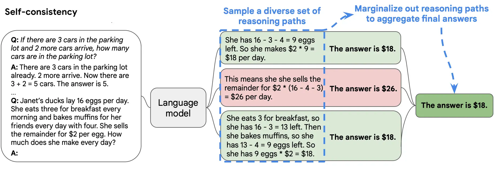
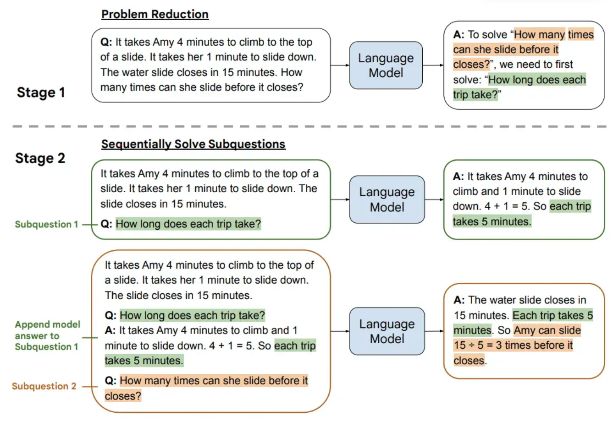
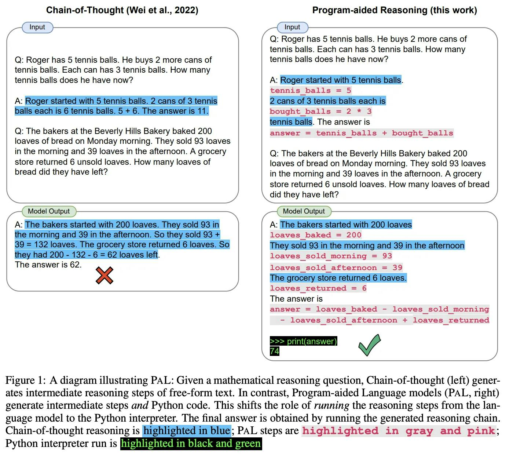

# Hello there 🙋🏻‍♂️
We are now learning from the site: [LearngPrompting.org](https://learnprompting.org/docs/)

Let's just see the overall highlights.

# `1.` First examples and then give the instructions in the last
Because if we give **examples in the last, end** then the model **may start generating more** of the given examples. So, giving instruction in the end is preferred.

This may not matter much in the latest model though 🤷🏻‍♂️ 

# `2.` Setting a role! Good example!
```markdown
🔴 PROMPT

Write in the style and quality of an expert in [field] with 20+ years of
experience and multiple PHDs. Prioritize unorthodox, lesser known advice in
your answer. Explain using detailed examples, and minimize tangents and humor.
```


# 📖 Misc: **Some good snippets**
**`1.` Frequency Penalty**
- Frequency penalty is a setting that discourages repetition in the generated text by penalizing tokens proportionally to how frequently they appear. The more often a token is used in the text, the less likely the AI is to use it again.


**`2.` Presence Penalty**
- The presence penalty is similar to the frequency penalty, but flatly penalizes tokens based on if they have occurred or not, instead of proportionally.

# `3.` CoT (simple)
This is where we give some example(s) to the model before the main question.

# `4.` Zero Shot CoT
Here, we **don't give the examples** but we just tell the model **`let's think step by step**`.

> **🔥 Hot line**
> Here, rather than giving the answer in the **full single prompt** we create `2` prompts. Example below.

EXAMPLE
```markdown
🔴 PROMPT 1
Manish has 2 balls, and he gives 1 to Suresh, how many does Guddu has?
**Let's think step by step**

👉🏻 RESPONSE
- ...
- ...
- ...

🔴 PROMPT 2
Manish has 2 balls, and he gives 1 to Suresh, how many does Guddu has?
**Let's think step by step**

- ...
- ...
- ...

👉🏻 RESPONSE
The answer is 0.
```

As you can see **the response of the prompt 1** is not faded in the **prompt-2** and this will work more effectively, but at the cost of more tokens.

# `5.` Self Consistancy (🔥🔥🔥🔥)
Self-consistency1 is an approach that simply asks a model the **same prompt multiple times** and takes the **majority** result as the final answer.



# `6.` Generated Knowledge
When you need to generate some **content** then, **instead of directly telling the GPT to generate it**, you fist tell it to generate like `10 facts about XX` and then based on it, let it generate the stuff.

Doing that, **will ensure that** GPT is not generating wrong content.

# `7.` Least to most prompting
> *Least to Most prompting **takes COT prompting a step further** by first breaking a problem into **sub problems** then solving each one. It is a technique inspired by real-world educational strategies for children.*



- Ask question
- Start questioning **which information would you need first**.
- Then solve each of them at a time.
- Then overall question will be answered 🤗

🟢 EXAMPLE
```markdown
🔴 PROMPT
CUSTOMER INQUIRY:
I just bought a T-shirt from your Arnold collection on March 1st. I saw that it was on discount, so bought a shirt that was original $30, and got 40% off. I saw that you have a new discount for shirts at 50%. I'm wondering if I can return the shirt and have enough store credit to buy two of your shirts?

INSTRUCTIONS:
You are a customer service agent tasked with kindly responding to customer inquiries. Returns are allowed within 30 days. Today's date is March 29th. There is currently a 50% discount on all shirts. Shirt prices range from $18-$100 at your store. Do not make up any information about discount policies.

**What subproblems must be solved before answering the inquiry?**

👉🏻 RESPONSE

1. Determine if the customer is within the 30-day return window.
2. Calculate the amount of store credit the customer would receive if they returned the shirt.
3. Calculate the cost of two shirts at the current 50% discount.
4. Determine if the customer has enough store credit to purchase two shirts.
```

Then in the new prompt...
```markdown
🔴 PROMPT
CUSTOMER INQUIRY:
I just bought a T-shirt from your Arnold collection on March 1st. I saw that it was on discount, so bought a shirt that was originally $30, and got 40% off. I saw that you have a new discount for shirts at 50%. I'm wondering if I can return the shirt and have enough store credit to buy two of your shirts?

INSTRUCTIONS:
You are a customer service agent tasked with kindly responding to customer inquiries. Returns are allowed within 30 days. Today's date is March 29th. There is currently a 50% discount on all shirts. Shirt prices range from $18-$100 at your store. Do not make up any information about discount policies.

**Determine if the customer is within the 30-day return window. Let's go step by step.**
```

# 😳 The **Exemplars** Prompt Advices
- The format of the **exemplars** in a prompt is **crucial**. It instructs the LLM on how to structure its response.
- Interestingly, the actual answers or 'ground truth' in the exemplars are **not as important** as one might think.
- Research shows that providing **random labels** in the exemplars (as seen in the above example) has **little impact** on performance.
- While the ground truth may not be crucial, the **labelspace** is - For example, if you have a dataset of restaurant reviews and **60%** of them are positive, your prompt should contain a **3:2 ratio** of positive/negative prompts.
- When creating prompts, using between **4-8 exemplars** tends to yield good results. 🌟

# 🔤 When solving the MCQs...
- Let the model to "think" before jumping to the answer.
- So adding `Let's think step by step` will work here.

# **MRKL** 🔥🔥🔥🔥🔥
Certainly! Here's a reformatted version of your lecture notes with important words in **bold** and improved formatting:

---

**MRKL Systems** (Modular Reasoning, Knowledge, and Language, pronounced "miracle") are a **neuro-symbolic architecture** that combine **LLMs** (neural computation) and external tools like **calculators** (symbolic computation) to solve complex problems.

A **MRKL system** is composed of a set of **modules** (e.g., a calculator, weather API, database, etc.) and a **router** that decides how to 'route' incoming natural language queries to the appropriate module.

A simple example of a MRKL system is a **LLM** that can use a **calculator app**. This is a **single module system**, where the **LLM** is the router. When asked, *"What is 100*100?"*, the **LLM** can choose to extract the numbers from the prompt and then tell the **MRKL System** to use a calculator app to compute the result.

> The **MRKL system** would see the word **CALCULATOR** and plug *100*100* into the calculator app. This simple idea can easily be expanded to various symbolic computing tools.

Consider the following additional examples of applications:

1. A chatbot that is able to respond to questions about a financial database by extracting information to form a **SQL query** from a user's text.
    - *"What is the price of Apple stock right now?"*
    - The current price is **DATABASE** `SELECT price FROM stock WHERE company = "Apple" AND time = "now"`

2. A chatbot that is able to respond to questions about the weather by extracting information from the prompt and using a **weather API** to retrieve the information.

# Program Aided Reasoning (PAL)
They send the code to a programmatic runtime to get the result. PAL works in contrast to CoT; 




🙋🏻‍♂️

Bye, let's meet you in the next phase of the course!