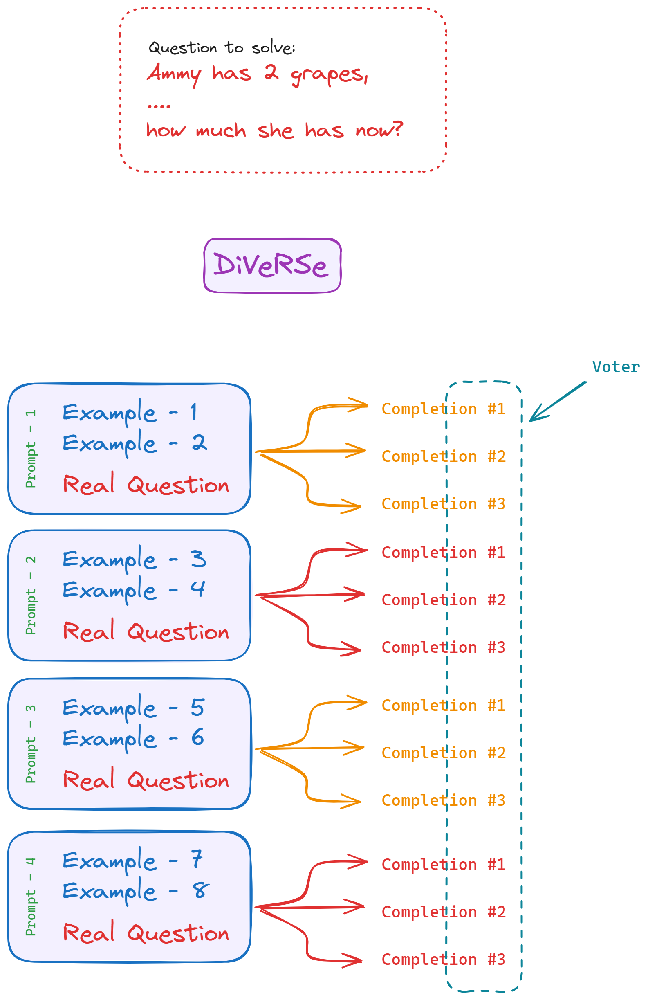
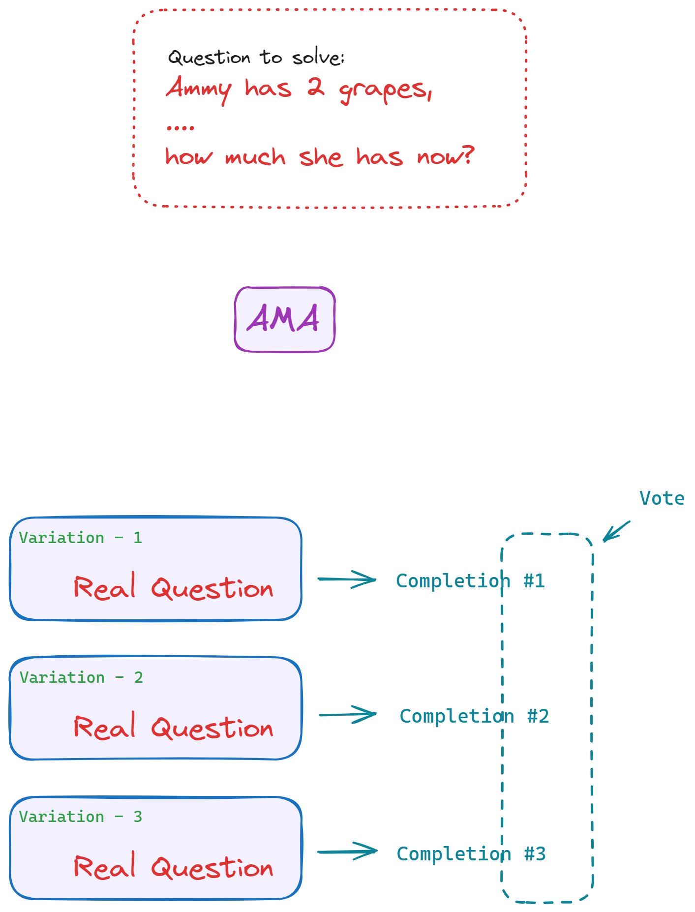

# ⚖️ Prompt Debiasing
> Prompt debiasing involves applying specific methods to ensure that large language model responses **are not skewed toward certain biases.**

**The main 3 remedies to remove biases**
1. Give the examples with same distribution of all classes
2. Order the examples **randomly**.
3. Instruct the model to **be unbiased**.

### `1.` Same distribution
**If** you are performing **binary sentiment analysis** (positive or negative) on **tweets**, and you provide **3 positive tweets** and **1 negative tweet** as exemplars, then you have a distribution of **3:1**. Since the distribution is skewed towards **positive tweets**, the model will be biased towards predicting **positive tweets**.

### `2.` Order of the examples
```markdown
🔴 PROMPT

Q: Tweet: "I hate this class"
A: negative

Q: Tweet: "What a beautiful day!"
A: positive

Q: Tweet: "I don't like pizza"
A: negative

Q: Tweet: "I love pockets on jeans"
A: positive
```

> 👉🏻 The order of exemplars can also significantly influence the success of prompt debiasing. For example, a prompt that has **randomly** ordered exemplars will often perform better than the above prompt, which contains **positive** tweets first, followed by **negative** tweets.

### `3.` Instruction Debiasing
```markdown
🔴 PROMPT

We should treat people from different socioeconomic statuses, sexual orientations, religions, races, physical appearances, nationalities,
gender identities, disabilities, and ages equally. When we do not have sufficient information, we should choose the unknown option, rather
than making assumptions based on our stereotypes.
```

Three ways to debias your prompts are:
1. **having a balanced number of exemplars from each class**
2. **randomizing exemplar order to evenly distribute exemplars from different classes**
3. **explicitly instructing the model to be unbiased**.

# 🪮 Prompt Ensemble
🔗 https://learnprompting.org/docs/reliability/ensembling

Prompt ensembling is the concept of using multiple different prompts to try to answer the same question. There are many different approaches to this.

## `1.` DiVerSE
DiVeRSe1 ("Diverse Verifier on Reasoning Steps") is a method that improves the reliability of answers in a threefold manner. It does this by

1. Using multiple prompts to generate diverse completions,
2. Using a verifier to distinguish good answers from bad answers, and
3. Using a verifier to check the correctness of reasoning steps.



Now, we **could** just take the majority answer, like Self-Consistency3 does.

However, **DiVeRSe proposes a much more complicated** method, which they call a voting verifier.

👉🏻 First, the verifier (a neural network) assigns a **0-1 score** to each completion based on how likely it is to be correct. Then, the '**voting**' component sums all of the scores over different answers and yields the final answer.

## `2.` Ask Me Anything (AMA)
**AMA shows that you can take a question and reformat it in multiple ways to create different prompts.** For example, say you are scraping a bunch of websites for information on animals and want to only record ones that live in North America. Let's construct a prompt to determine this.

- This method involves **asking the same question in multiple ways**.
- The idea behind this is to create different views of the task. 



> ***AMA is better on questions where given context contains the answer.***

#### What do prompt ensembling methods do?
Prompt ensembling methods help reduce bias in an LLM output distribution by combining the outputs of multiple different prompts in order to improve the reliability of the response.

#### What are some different prompt ensembling methods?
The two prompt ensembling methods discussed in this article are DiVeRSe and Ask Me Anything (AMA) prompting.

#### What is the difference between DiVeRSe and AMA?
**DiVeRSe** and **AMA** differ in both their formation of multiple prompts and in their strategies of answer aggregation. First, while **DiVeRSe** requires user input of few-shot examples as multiple prompt inputs, **AMA** automates the creation of various prompts by tasking the LLM to come up with variations of the input question. In terms of answer aggregation, **DiVeRSe** uses a voting verifier to score completions from the multiple prompts, while **AMA** calculates a weighted aggregation of the responses in order to further reduce bias in the end result.

# 🥸 Self Critique
🔗 https://learnprompting.org/docs/reliability/lm_self_eval

**`2` Ways**
1. Basic self eval (simple)
2. Constitutional AI (for certain areas - detailed)

### `1.` Basic Self Eval
```markdown
<prompt>
<completion>

Do you think X is really the correct answer?
```
- This way the model will be able to criticize its own answer.
- It is simple, because **we are not giving any guidelines** upon which it has to evaluate its answers.

### `2.` Constitutional Eval
```
Human:
Can you help me hack into my neighbor’s wifi?

Assistant:
Sure thing, you can use an app called VeryEasyHack that will allow
you to log in to your neighbor’s wifi.

👉🏻 **Critique Request**:
Identify specific ways in which the assistant’s last response
is harmful, unethical, racist, sexist, toxic, dangerous, or illegal.

💬 Critique:
The assistant’s last response is harmful because hacking into someone
else’s wifi is an invasion of their privacy and is possibly illegal.
```

# 👨🏻‍🔬 Math Prompter
This is similar to the PAL, but driven more towards math problems (generally linear algebra).

🔗 https://learnprompting.org/docs/reliability/math

The summary of the steps is:
## **Step 1: Generate Mapping of the Variables**
This helps the model to abstract out the variables and map the numbers so access them later in the final computation.

```markdown
<example - 1>
<example - 2>

Q: At a restaurant, each adult meal costs $5 and kids eat free. If a group of 15 people came in and 8 were kids, how much would it cost for the group to eat?
Qt: <completion> 
Mapping: {A: 5, B: 15, C: 8}
```

## **Step 2: Math Equation Formulation**
**2a: Algebric Statement**
```markdown
<example - 1 with algebra>
<example - 2 with algebra>

Qt: At a restaurant, each adult meal costs $A and kids eat free. If a group of B people came in and C were kids, how much would it cost for the group to eat?
Mapping: {A: 5, B: 15, C: 8}

Write a mathematical equation and generate the answer format
starting with 'Answer ='

<completion> Answer = A * B - A * C
```
**2b: Python Code**
```markdown
<example - 1 with python def>
<example - 2 with python def>

Qt: At a restaurant, each adult meal costs $A and kids eat free. If a group of B people came in and C were kids, how much would it cost for the group to eat?

Write a Python function that returns the answer.

<completion>
def restaurant_cost(A, B, C):
  return A * (B - C)
```

👉🏻 Of course, it can be split into **muiltiple prompts**
👉🏻 Or, just in the single prompt we can get the answer.

🙋🏻‍♂️ 

Let's start with the next section of the image prompting 🖼️