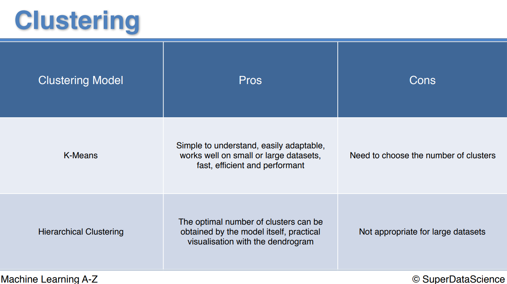
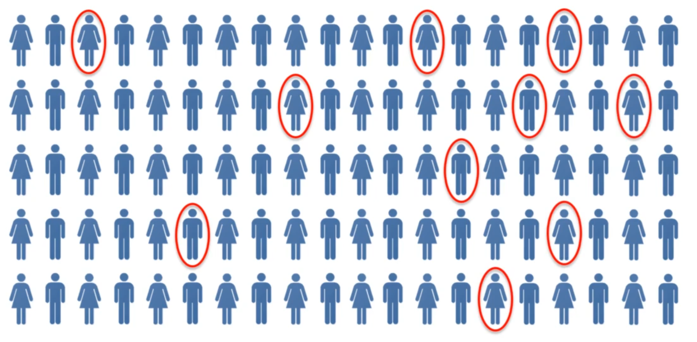
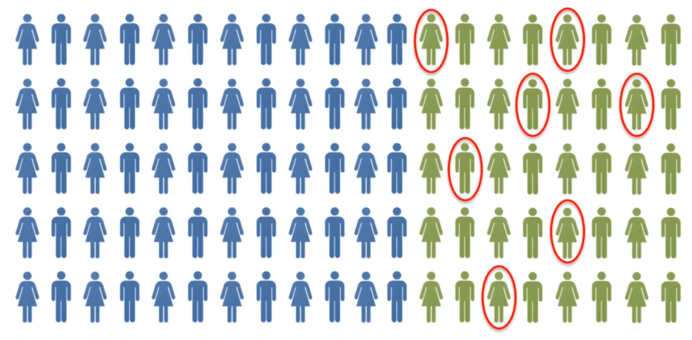

# K-Means++

- First randomly selects the point and then calculates the distances from that centroid with each datapoint.

- Then initializes the next centroid with **weighted random fashion**.

- So only difference is **the initialization in the K-Means++** is done in the **weighted random fashion**.

# Hierarchical

- Two types:
  
  - Agglomerative
  
  - Divisive

> 👉🏻 *It finds all clusters and converges when all points are covered in the single cluster. **The memory is stored in the dendrogram**.*

## 😲 Dendrogram is an amazing tool!

1. It helps to **get the number of clusters** *(which is obvious)*

2. But also helps to get the "optimal" number of clusters that **you should choose** because it also plots the Euclidean distance!

1️⃣ **Approach - Special:** Find the longest vertical line and that will be the optimal number of clusters!! 

# Association Rule!

- **Not in sequence,** but combined together, watched together, bought together!

- We find the **rules or ways** that it happens (pairs, triplets, quads...)

- There can be many rules, **some of them are strong and some of them are weak**.

## 1️⃣ Apriori

It has `3` components:

1. Support

2. Confidence

3. Lift

## Scenario to keep in mind:

→ There are `100` people

→ They have seen many movies

→ Our focus is to "recommend" the movie **"Ex Machina"**

→ We have knowledge that some of them have seen **"Interstellar"** already.

### `1.` Support

> #### 💪🏻 Explanation:
> 
> Just finds ***out of all population, how many have seen "Ex Machina".*** We find this just for the movie that we are going to recommend to other population.
> 
> #### 📝 Note:
> 
> Remember! This is done in the training data and ***we assume*** that the same data behavior is applied for the other population — so if 10% have watched this movie in the training data, that means outside world ***will also have 10% people who have watched this movie.***

$ Support = \frac{\text{n people watched movie}}{\text{total people}} = \frac{\text{10 people watched Ex machina}}{\text{100 people total}} = 10\% $

💡 **Interpretation:** When you go out and **suggest the Ex-machina** to the general people at all, then **there are 10% chances that the given person will like that movie** or out of 100, 10 people will like the movie — again, if you just go out in random without any knowledge.

### `2.` Confidence

> #### 💪🏻 Explanation:
> 
> When you ***know*** that some person likes "interstellar" then confidence gives you the percentage, how many of them also liked "Ex machina".
> 
> That means, say out of `100` people, `40` of them already have seen interstellar *(yeah then interstellar's support would by 40%, but we won't find that as we are not interested in suggesting that movie ;)* so we can know that out of these `40` dudes, there are `7` dudes who have ***also seen*** Ex machina.

$Confidence = \frac{\text{n people who watched interstaller \& Ex machina}}{\text{n people watched interstaller}} = \frac{\text{7 people with interstellar \& Ex machina}}{\text{40 people watched interstaller}} = 17.5\% $

💡 **Interpretation**: Confidence is just the conditional probability, that if you "already know" that person has watched Intersteller then **"what confidence you have that that person will also like Ex machina?"**. 

This is what answered by this number, `17.5%`. Means if you ask 100 people who have watched interstaller, then 17.5 them will like Ex machina! And indeed, this knowledge is good because **<u>just random</u>** it was `10%` and now it is `17.5%`!

And ***how good is knowing this is!?*** is answered by **LIFT 👇🏻**

### `3.` Lift

> #### 💪🏻 Explanation
> 
> You know the "general likelihood" of people liking the ex machina (10% - support) and you now also have confidence that people who like interstaller will like ex machina 17.5%. 
> 
> So, this **lift** answers "how better your confidence is over your support". Or in other terms, if you prupose this ex machina to those who have seen interstaller, how much lift in the gain will that give?
> 
> Of course `17.5` - `10` = `7.5%` high, right? But slightly different. And that is what lift does.

$ Lift = \frac{\text{confidence(interstaller \& ex machina)}}{\text{support(ex machina)}} = \frac{17.5}{10} = 1.75$

💡 **Interpretation:** Means, if you choose purposing those who have seen interstaller, then you will have `1.75` more lift than the simple random guessing. *(Note that this 1.75 doesn't have the percentage sign!)*

# 2️⃣ Eclat

> *Here we **won't** be finding the rules, because the rules are for Apriori ;) — here we will talk about the "sets".*

💭 ***In Eclat we only have "support"***; in contrast to the Apriori where we have support, confidence and lift.

### 👇🏻 Simply Explained!

1. Recall the "support" in Apriori... the support means ***the proportion of the given movie in the entire population.***

2. Now, that means if you go in the public and if you have the support of `10%` of Ex Machina, then that means just simply ex machina will be sold for 10% of the users.

3. The confidence ***was*** support, remember! But there was **an arrow** which tells "first seen interstaller?" then "ex machina". Both mean different things, if Ex Machina then interstaller, it would be different. 

4. 👉🏻 **The support of eclat *is* confidence! But without any arrow**. 

5. So we will find the proportion of **at least 2 items in support** instead of single item as did in the Apriori.

6. We will directly see the people who have seen interstaller and Ex machina both, and just both, there **are no arrows.** So that will be the same always. See?

7. Thus, this Eclat is the simpler version of Apriori.

8. You can have 3, 4, 5 items!

> That's why **set** and **not rules!**

# Next up...

Reinforcement learning... may require some coding this time 🤗
