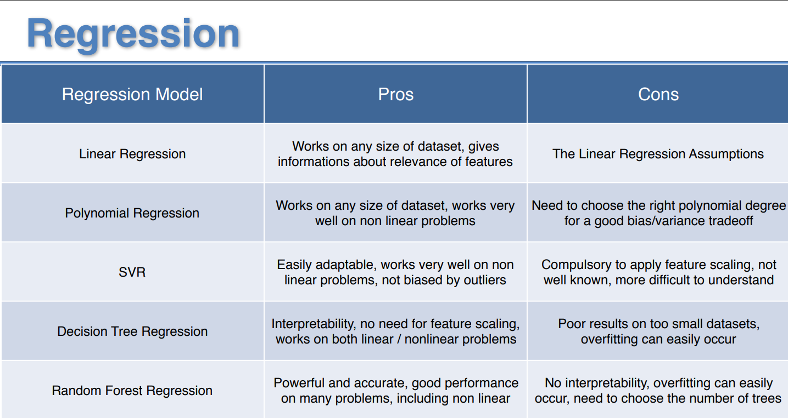
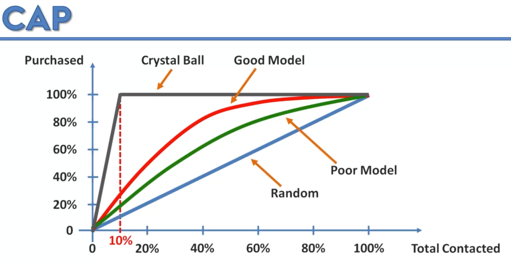

# 🔥 Information Gain / Entropy

> This is basically ***whether adding a new split on this spot adds any value to better seperate the given datapoints?***

That's where the algorithm has to stop, when it knows that certain level of information needs to be added level is met or not.

# 🧪 R Squared (Adj)

When we add additional feature in the model, **the total sum of squares** (the denominator) doesn't change okay, because that is just the variance (the average model) ***but the numerator <u>will decrease</u> or stay the same!!!***. Which leads to overall R-square to increase!

> ## 😲
> 
> It happens on the equation based models like linear regression because *when we add new variable, the OLS method tries to find such a coef which minimizes the error, if it doesn't find a good coef, then it will be zero but the overall R2 will be the same or will increase — it happens may be by the **virtue of the random correlation between the added variable**.*

# 🥂 Some Factual Stuff



# Support Vector Classifier

It is a **binary classifier** by nature. But you can make use of it using OVO and OVR kind of workaround 🤗

> The SVC is **very special** because it uses the "extreme examples" or extreme points to base its separation analysis. 

*Kernel trick is just a function which returns a value which we will use to give the "weight" to that point where does it fit on the given kernel and the kernel is the shape. So, it helps project the points in higher dimension without going to the higher dimension.*

## 💥 New!

We can have **multiple kernels** for the single problem! This is great! Let me share an image:


**In this case** we would need **two models!!** 

```python
def custom_kernel(X, Y):
    rbf_kernel = SVC(kernel='rbf', gamma='scale').fit(X, Y).kernel
    linear_kernel = SVC(kernel='linear').fit(X, Y).kernel
    alpha, beta = 0.5, 0.5  # Adjust weights as needed
    return alpha * rbf_kernel(X, Y) + beta * linear_kernel(X, Y)

# Create an SVC instance with the custom kernel
svm_model = SVC(kernel=custom_kernel)
```

> ## Note
> 
> *The red points 🔴 in the image represent the **landmark** which are used in kernels to find the distance of a given datapoint and to calculate their value. Each kernel will have its own landmark and **their positions are determined automatically**.*

# 👶🏻 Bayes theorem

1. **Bayes' Theorem:**
   
   - **Definition:** Bayes' theorem is a fundamental theorem in probability theory, named after the Reverend Thomas Bayes. It describes the probability of an event based on prior knowledge of conditions that might be related to the event.
   - **Formula:** The theorem is mathematically expressed as follows:
     $P(A|B) = \frac{P(B|A) \cdot P(A)}{P(B)}$
     Here, $P(A|B)$ is the probability of event A given that event B has occurred.

2. **Naive Bayes:**
   
   - **Definition:** Naive Bayes is a classification algorithm based on applying Bayes' theorem with the "naive" assumption of independence between every pair of features. This assumption simplifies the computation and is why it is called "naive."
   - **Application:** It is commonly used for text classification problems, such as spam filtering and sentiment analysis. Despite its simplicity and the naive assumption, Naive Bayes often performs well in practice, especially with high-dimensional data.

## 🎧 Cool Example for Bayes Theorem

### Scenario

- Suppose Tesla makes a car "Model S"

- There are two machines which make this Model S: M1 and M2

- We know from the car's chassis plate that by which machine the car is made (M1 or M2)

- Some of the cars are defective and needed to trash.

- 🔎 **We want to know if I pick a sample car at random, what is the probability that this defective model is made by the machine M2?.**

### Information

- 60% cars are produced by M1 and 40% are produced by M2.

- Out of all produced cars 10% are defective.

- Out of all defective, 50% are of M1 and 50% are of M2.

### Think Step-by-Step

> *Now we have sufficient information to get started. This **is the standard framework that you can use to think through ANY problem for the baysian problem** .*

And right-away from the given information we can see that the **contribution of the defective cars from M2 is higher** as it only produces `40%` of all production and still its contribution of defective cars is `50%`!

1. ***<u>Frequentist Method</u>***
   
   In this method, we think **very intuitively** by taking the example. This is my favorite method of thinking. Probably, I am a frequentist 🤗
- Let's say Tesla produces `1000` cars in a day.

- That means `600` are from M1 and `400` from M2.

- Total defective will be `100` cars (10%) 

- From which `50` cars would be from M2 *(and the rest from M1 since the defective probability is 50% for both).*

- Thus to answer the question ***If we pick up a car which is defective, what is the probability of it's belonging from M2?***: `50 / 400 = 0.125` or `12.5%`.

> **Yeah, that's the answer!** 

***<u>2. Baysian Method</u>***

Here, we just use the formulae instead of using the step-by-step approach.

$P(A|B) = \frac{P(B|A) \cdot P(A)}{P(B)}$

or

$P(\text{Defactive}|\text{M2}) = \frac{P(\text{M2}|\text{Defactive}) \cdot P(\text{Defective})}{P(\text{M2})}$

so

$P(\text{Defactive}|\text{M2}) = \frac{0.5 \times 0.1}{0.4} = 0.125$

Yo!?

> 💡 If you observe, the formulae implements **the same steps we followed in the frequentist method**.

# 🧪 The Cumulative Accuracy Profile (CAP)

Yo, so with the classification "Accuracy" on hand, we now know that this single metric won't be sufficient to assess the fit of the model. We need some better understanding of the model's performance. This new term came to me, so let's discuss that in this section.


**Explanation:**

- It may look like the "ROC" curve, but it is different. 

- Here, the **blue** line is the initial random model.

- The **red** line is the behavior we get by the model.

- Let's understand by an example below 👇🏻

**Example:**

- Let's say in our marketing world, ***"when you send the emails to `n` customers you are likely to get the response `10%` of them."***

- So, the blue line represents that random model where just throw in the emails to the customers and pray to get 10% response.

- Now, with ML... we deploy the model which gives **the chance** which customers are likely to respond beforehand **even before we send the email**; that way we will only send the emails to those who will respond! Saves time and effort! 🧠

- So, we do that and "the red line" shows that. Just by targeting say 2000 customers **before** we were getting `200` responses (10%) and now with the model, we get say `1500` responses!

- We deploy **multiple models** and get the curves like below 👇🏻


> 💡 This is also called **the gain chart!**

**The ideal model? The Crystal Ball 🔮**

- There is the black line if you can see... that's what the ideal model which predicts **perfectly** which 10% are the exact 10% people to target!



- **It has the *bump* at 10%** because in our world only 10% of the customers will ever respond, so we will target them only 🤗

- Also note that the **axis** have now converted to the percentage, which are the actual axis to be represented in the CAP curve.

**And a few rule of 👍🏻**:


# Pros-Cons


# So!

Let's head over to the next book!
