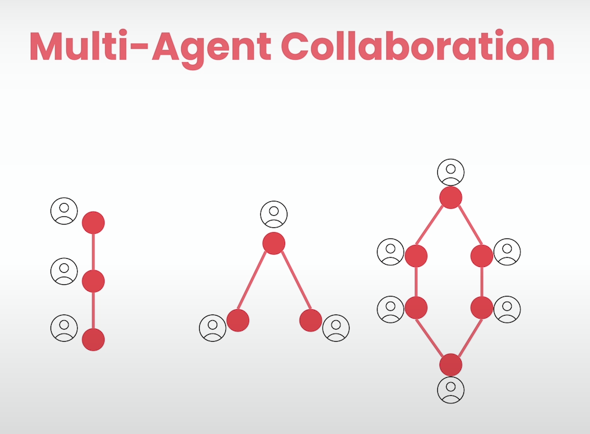

# 🫧 Why do we need agents!?

### 🔁 The problem *without* agents.

- You wrote a prompt, telling the LLM a task to perform, it does.
- You didn't like the tone.
- You **instructed again** and it gave you different response now.
- Now you **used your prompting skill** to tell the LLM to *fact check* it's own response, and it did.
- After that you just completed working with it and went for sleep.

You can realize that, you quickly become a blocker, as you have to be in there in the whole process, interacting it; in order to get the desired results.

### 💗 But what if...
... we use the **reasoning** capability of the LLM and make it to correct itself whenever possible? This is where the agents come in. 

> *Agents are the simple LLM prompts; often equipped with tools to access out side world which reason, execute and run multiple times until the specified task is fulfilled*
>
> — Me

**🤞🏻 The agents can work in many complex manner!**

### 👪 Multi-agent systems

- There can be multiple agents in a system.
- Let's call it **crew**.
- Each of them is **expert in doing one specific task**.
- They are equipped with tools and perform specific task.
- They collaborate and get the *(shit)* done.

## 👑 What makes the agent, great?

1. Role playing
2. Focus
3. Tools
4. Co-operation
5. Guardrails
6. Memory

#### `1.` Role Playing 💃🏻 
> Hot line:
> *It is **not just about telling it who it is**, but telling **specifically who it is**.*

Example of the line above:

**Instead of telling**: You're a financial analyst...  
**Tell**: You're a ***FINRA*** certified analyst...

The <u>specific word FINRA</u> makes difference in the outcome.

#### `2.` Focus 🎯

🙅🏻‍♂️ **Don't mix things up too much**. 

- Yes, there are **models** with a lot **longer context windows** than you will ever encounter (**2M** in **Gemini 1.5** at the time of writing this), but we need to be more specific and just tell what is important.
- *You shouldn't rely on one agent to do it all*.
- **Create different agents** to do **single, specific tasks**.

#### `3.` Tools 🔨 
🙅🏻‍♂️ **Also don't add a lot of tools to the agents!**

- Think agent as a person that you're hiring, and you will only give the tools that they will actually need; rather than giving so many tools which are unnecessary.

#### `4.` Cooperation 🫱🏻‍🫲🏻

> *Being to cooperate and bounce ideas **between each other** makes a huge difference.*

1. They can **take feedback from each other**
2. They can **delegate tasks from each other**...

#### `5.` Guardrails 🚧

**🙅🏻‍♂️ You don't want the following from happening:**  

1. You don't want your agents to stuck on random loops
2. Hallucinate
3. Use same tool repeatedly
4. Take a long time to respond

#### `6.` Memory 🧠💾

**This can make *immanse* difference**.

- Used to refer some piece further down.

There are `3` types of memory available in CrewAI:

1. Long-term memory
2. Short-term memory
3. Entity memory

# Tips with agents

1. Always use a QA agent, works best compared to the single agent system.
2. That QA agent (refer as quality assurance agent) checks the certain quality that we expect from the response of the first (or other) agents.

# I am leaving this course.
Enough, this library is very high level, and does all stuff automatically. I am a person who wants to go and run things at very low level. I can't see what exactly are the prompts running in the back end.

This library is good for fast deployment and manages agents with ease. But this is not my cup of tea.

Let's stop this and move on.